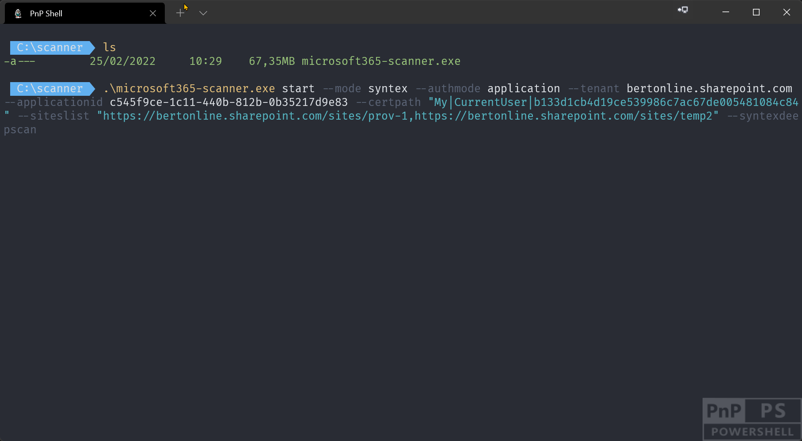

# Microsoft 365 Scanner
Microsoft 365 SharePoint scanning tool is an open source community tool that provides customers with data to help them with various deprecation and adoption scenarios. This tool is currently under development/testing, more features and especially more documentation will be added soon.

## Getting started 🚀

Minimal steps to run:
- Download the scanner for the OS you're using. Scanner versions can be found in the [releases](https://github.com/pnp/pnpscanning/tree/main/releases) folder
- Use the scanner CLI to operate it: `microsoft365-scanner.exe --help` will show the available commands

Common CLI calls are:

Task | CLI
-----|------
Start a new Syntex scan (application permissions) for a complete tenant | microsoft365-scanner.exe start --mode syntex --authmode application --tenant bertonline.sharepoint.com --applicationid c545f9ce-1c11-440b-812b-0b35217d9e83 --certpath "My&#124;CurrentUser&#124;b133d1cb4d19ce539986c7ac67de005481084c84"
Start a new Syntex deep scan (delegated permissions) for a set of site collections | microsoft365-scanner.exe start --mode Syntex --authmode interactive --tenant bertonline.sharepoint.com --siteslist "https://bertonline.sharepoint.com/sites/prov-1,https://bertonline.sharepoint.com/sites/temp2" --syntexdeepscan
List all the scans | microsoft365-scanner.exe list
Realtime status update of the running scans | microsoft365-scanner.exe status
Pause a running scan | microsoft365-scanner.exe pause --id &lt;scan id&gt;
Restart a paused or terminated scan | microsoft365-scanner.exe restart --id &lt;scan id&gt;  
Generate PowerBI report (includes CSV export) | microsoft365-scanner.exe report --id &lt;scan id&gt;
Export the gathered data to CSV | microsoft365-scanner.exe report --id &lt;scan id&gt; --mode CsvOnly --Path &lt;location to put CSV files&gt;



### Setting up your Azure AD application

The scanner requires Azure AD based authentication and supports application permissions (app-only) and delegated (user) permissions. Application permissions is the recommended approach as this way the scanner does have guaranteed access to all the sites in your tenant. If you use delegated permissions than you can either use the `Interactive` mode or the `Device` authentication mode. `Device` mode works on all OS's, including Linux as you authenticate the scan from any device. `Interactive` will popup a browser session and ask you to authenticate. Application permissions require you to use a certificate for authentication and this certificate can be provided via a reference to a certificate in a local certificate store e.g. "My&#124;CurrentUser&#124;b133d1cb4d19ce539986c7ac67de005481084c84" or via providing a PFX file and password (`--certfile "MyCertificate.pfx" --certpassword ***`). 

If you don't specify the `--applicationid` argument the scanner will try to use the PnP Management Shell app (the one you use for [PnP PowerShell](https://pnp.github.io/powershell/)), but it's recommended to create a dedicated app for scanning as that way you can limit the permissions granted. Using PnP PowerShell this becomes really simple. Below cmdlet will create a new Azure AD application, will create a new self-signed certificate and will configure that cert with the Azure AD application. Finally the right permissions are configured and you're prompted to consent these permissions.

```PowerShell
# Ensure you replace contoso.onmicrosoft.com with your Azure AD tenant name
# Ensure you replace joe@contoso.onmicrosoft.com with the user id that's an Azure AD admin (or global admin)

Register-PnPAzureADApp -ApplicationName Microsoft365Scanner `
                       -Tenant contoso.onmicrosoft.com `
                       -Store CurrentUser `
                       -GraphApplicationPermissions "Sites.FullControl.All" `
                       -SharePointApplicationPermissions "Sites.FullControl.All" `
                       -Username "joe@contoso.onmicrosoft.com" `
                       -Interactive
```

### Permissions required

The scanner aims to be able to perform the scan task at hand using minimal read permissions, but for certain scans not all features work when using minimal permissoins.

Scan | Authentication | Minimal | Optimal | Details
-----| ---------------| --------|---------|--------
Syntex | Application | **Graph:** Sites.Read.All, **SharePoint:** Sites.Read.All | **Graph:** Sites.Read.All, **SharePoint:** Sites.FullControl.All | When using the `--syntexdeepscan` argument the scanner will use the search APIs to count how many documents use a given content type, and search in combination with application permissions requires Sites.FullControl.All
Syntex | Delegated | **Graph:** Sites.Read.All, **SharePoint:** Sites.Read.All | **Graph:** Sites.Read.All, **SharePoint:** Sites.Read.All |


## I want to help 🙋‍♂️

If you want to join our team and help, then feel free to check the issue list for planned work or create an issue with sugggested improvements.

## Supportability and SLA 💁🏾‍♀️

This tool is an open-source and community provided tool backed by an active community supporting it. This is not a Microsoft provided tool, so there's no SLA or direct support for this open-source component from Microsoft. Please report any issues using the [issues list](https://github.com/pnp/pnpscannning/issues).

## FAQ

### Running on MacOS or Linux

The scanner can be used on MacOS and Linux except the PowerBI report generation as the PowerBI client only is available for Windows. After copying the needed binary from the [releases](https://github.com/pnp/pnpscanning/tree/main/releases) folder you need to mark the binary as executable via `sudo chmod +x microsoft365-scanner`. Once that's done you can use the scanner, the scanner binary itself contains all the needed depencies (including the .NET 6 runtime). 

If you later on want to generate a PowerBI report for a scan ran on Linux of MacOS, you then can copy the scan output folder (guid = scan id, located in the folder containing the binary) to the folder on a Windows machine where you've put the Windows version of the scanner. When you then use `microsoft365-scanner.exe report --id <scan id>` the report will be generated and opened in PowerBI.

### Running on a GCC, GCC High, DoD or China tenant / running the scanner on a port different from 25025

The scanner can be used to run against tenants hosted in other cloud environments. Doing this requires the manual addition of a settings file named `appsettings.json` in the same folder as the scanner binary. Below are the sample settings for selecting another cloud environment:

```json
{
  "PnPCore": {
    "Environment": "USGovernment"
  },
  "CustomSettings": {
    "Port": 7887
  }
}
```
Valid values for environment are: `Production`, `PreProduction`, `USGovernment` (a.k.a GCC), `USGovernmentHigh` (a.k.a GCC High), `USGovernmentDoD` (a.k.a DoD), `China` and `Germany`.

When you for some reason port 25025 is occupied on your machine you can configure the scanner by providing an alternative port number via the `appsettings.json` file.


**Community rocks, sharing is caring!**

This project has adopted the [Microsoft Open Source Code of Conduct](https://opensource.microsoft.com/codeofconduct/). For more information see the [Code of Conduct FAQ](https://opensource.microsoft.com/codeofconduct/faq/) or contact [opencode@microsoft.com](mailto:opencode@microsoft.com) with any additional questions or comments.
