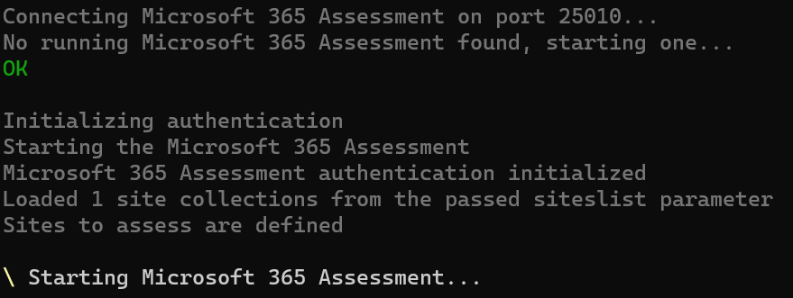

# Run a SharePoint Add-In and Azure ACS assessment

Running the SharePoint Add-In and Azure ACS assessment is just like running any other adoption or deprecation module of the Microsoft 365 Assessment tool: you use the CLI with the `Start` action to launch an assessment. By specifying the `--mode` to be `AddInsACS` the Microsoft 365 Assessment tool will run the SharePoint Add-In and Azure ACS assessment for you. This page provides you with a quick start and links to the relevant Microsoft 365 Assessment tool documentation for more details.

## Quick start

### Download the Microsoft 365 Assessment tool

The Microsoft 365 Assessment tool must first be downloaded from https://github.com/pnp/pnpassessment/releases. More details can be found in the [download](../using-the-assessment-tool/download.md) documentation.

### Ensure you've an Entra application setup

The Microsoft 365 Assessment tool requires an Entra application for authenticating to SharePoint. More details in the [authentication](../using-the-assessment-tool/setupauth.md) documentation.

### Start assessment

Below are some quick start samples that show how to run a SharePoint Add-In and Azure ACS assessment. More details on the `Start` action can be found in the [Microsoft 365 Assessment tool Start documentation](../using-the-assessment-tool/assess-start.md).

Task | CLI
-----|------
Start a new SharePoint Add-In and Azure ACS assessment (application permissions) for a complete tenant | microsoft365-assessment.exe start --mode AddInsACS --authmode application   --tenant bertonline.sharepoint.com --applicationid c545f9ce-1c11-440b-812b-0b35217d9e83   --certpath "My&#124;CurrentUser&#124;b133d1cb4d19ce539986c7ac67de005481084c84"  
Start a new SharePoint Add-In and Azure ACS assessment (delegated permissions) for a set of site collections | microsoft365-assessment.exe start --mode AddInsACS --authmode interactive   --tenant bertonline.sharepoint.com   --siteslist "https://bertonline.sharepoint.com/sites/ussales,https://bertonline.sharepoint.com/sites/europesales"

> [!Note]
> As a first step in the assessment all Azure ACS principals are retrieved which happens once for the assessment, regardless of how many sites are assessed. Depending on the number of Azure ACS principals this can take a long while and when this happens the assessment outputs "Starting Microsoft 365 Assessment...". Please let the tool just run, eventually the individual site assessment will start and the prompt will return.
> 

### Live status updates

Once an assessment is launched you'd typically followup on it's status via the `Status` action. Below is a quick start, more details can be found in the [Microsoft 365 Assessment tool operations documentation](../using-the-assessment-tool/assess-operations.md#getting-a-live-status-overview-of-a-running-assessment).

Task | CLI
-----|------
Realtime status update of the running assessments | microsoft365-assessment.exe status

### Generate report

When an assessment has finished you can continue with the next step and that's generating the Power BI report by using the `Report` action. Below is a quick start, more details can be found in the [Microsoft 365 Assessment tool Report documentation](../using-the-assessment-tool/assess-report.md).

Task | CLI
-----|------
Generate Power BI report (includes CSV export) in the default location | microsoft365-assessment.exe report --id 22989c75-f08f-4af9-8857-6f19e333d6d3
Export the gathered data as CSV files in a custom location | microsoft365-assessment.exe report --id 22989c75-f08f-4af9-8857-6f19e333d6d3   --mode CsvOnly --path "c:\reports"

To better understand the generated Power BI report and accompanying CSV files use the nodes in the left navigation.
