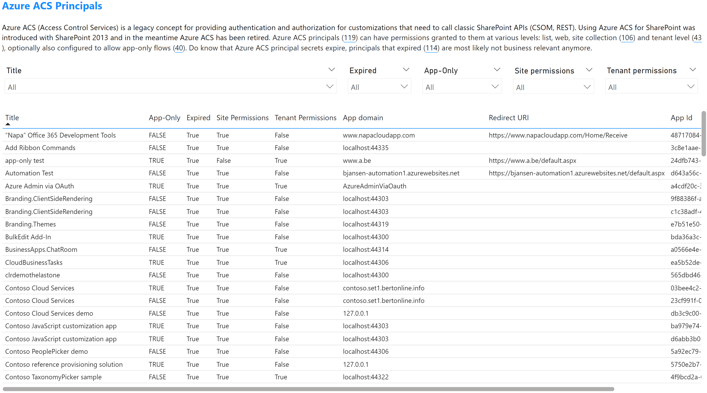

# Azure ACS Principal overview

Using this report page you'll be able to list all the discovered Azure ACS principals. Azure ACS principals are a legacy auth concept used to grant applications (e.g. Provider Hosted SharePoint Add-Ins) access to SharePoint. Use the table on this report page to get an overview, apply the filters to scope your overview when needed. In the shown table these columns are presented:

Column name | Description
------------|------------
Title | Title of the Azure ACS principal
App-Only | Can this Azure ACS principal be used to grant an application access without a user (so called app-only or application permissions)
Expired | Is the secret generated for this principal still valid, when expired the Azure ACS principal cannot access SharePoint anymore
Site Permissions | Was this Azure ACS principal configured with permissions for one or more specific site collections, webs or lists?
Tenant Permissions | Was this Azure ACS principal configured with permissions that apply to the whole tenant?
App domain | The configured application domain
Redirect URI | The configured redirect URI
App Id | The id of the Azure ACS principal

## Sample page

