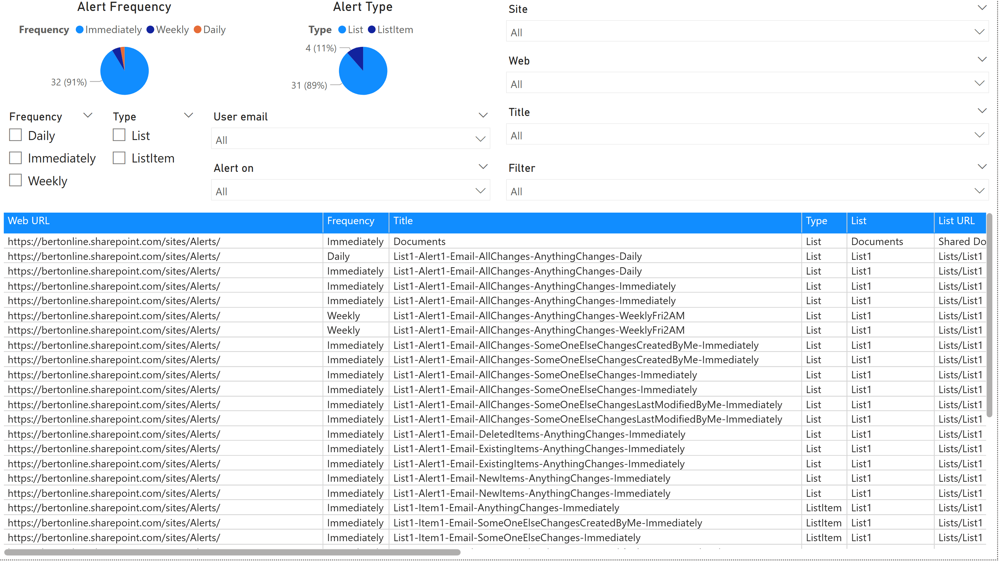

# Details

SharePoint Online alerts have been a key feature for notifying users about changes in lists, libraries, and list items. However, with the evolution of modern SharePoint and the introduction of more advanced notification mechanisms, traditional alerts are being phased out. This change aligns with Microsoft's efforts to modernize the SharePoint experience and improve compatibility with modern devices and workflows.

You can use the presented filters to scope down to the alerts you're interested in. In table these columns are presented:

Column name | Description
------------|------------
Web URL | The fully qualified URL of the web hosting the alert.
Frequency | The frequency of the alert (e.g., Immediate, Daily, Weekly).
Title | The title of the alert.
Type | The type of the alert (e.g., List, Item).
List | The name of the list or library associated with the alert.
List URL | The web-relative URL of the list the alert is related to.
Id | The unique identifier of the alert.
Template | The template name of the alert.
Alert on | The scope of the change the alert will work on.
Filter | Additional filter criteria for the alert scoping.
User | The display name of the user receiving the alert.
User type | The type of the user principal (e.g., User, Group).
User email | The email address of the user receiving the alert.

## Sample page

