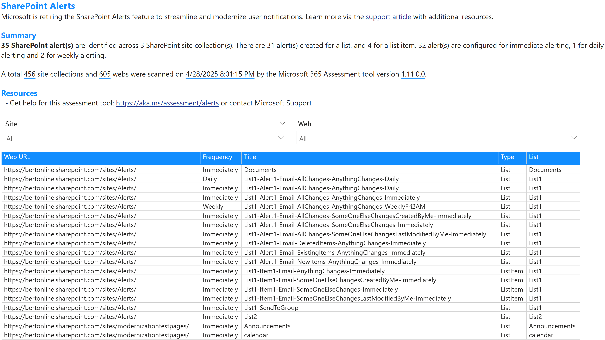

# Overview

SharePoint Online alerts have been a key feature for notifying users about changes in lists, libraries, and items. However, with the evolution of modern SharePoint and the introduction of more advanced notification mechanisms, traditional alerts are being phased out. This change aligns with Microsoft's efforts to modernize the SharePoint experience and improve compatibility with modern devices and workflows. In the shown table these columns are presented:

Column name | Description
------------|------------
Web URL | The fully qualified URL of the web hosting the alert
Frequency | The frequency of the alert (e.g., Immediate, Daily, Weekly)
Title | The title of the alert
Type | The type of the alert (e.g., List, Item)
List | The name of the list or library associated with the alert

## Sample page

