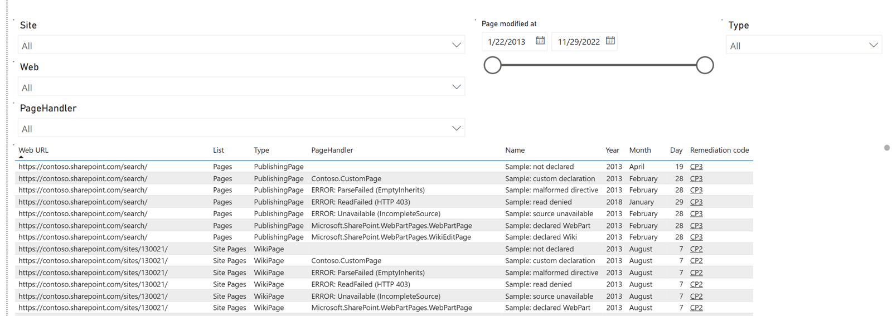
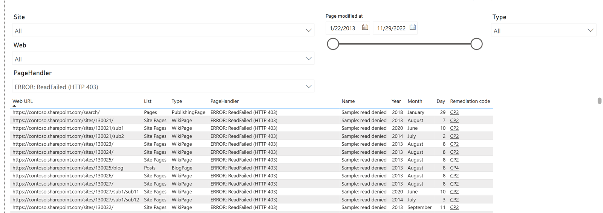

# The Power BI report

The generated report is a Power BI report and can be opened in Power BI Desktop (see https://aka.ms/pbidesktopstore to install Power BI Desktop).

When using the report from Power BI Desktop there are some things to understand:

- The report is built using multiple pages; use the bottom tabs to switch between them. The **Pages** page lists assessed classic pages, with their existing page type and declared `PageHandler` side by side. The Handler dropdown filters the same values shown in the table, including short read or parse errors.
- When the report is opened from the generated Power BI pbit file it's not saved, meaning if you close Power BI Desktop it will ask you to save the file. You can also save the opened report yourselves using the **save** icon top left; when saving as a Power BI pbix file the data and report are combined into a single file, making it easier for you to move around and share the report.
- If you want to update the visualizations used you can use the toolbar and visualizations and fields sections at the right.

The template supports older `classicpages.csv` files without `PageHandler`: the added column
is shown as empty. New CSV files display the declared type or the error value directly in
that column. Detailed Handler evidence remains in the assessment database and is not imported
into the report. Handler values describe analysis results, independently of discovery coverage.
The page query keeps a fixed set of report columns, so loading a newer CSV does not add
identity columns that would prevent subsequent refreshes from older exports.

The examples below use anonymized sample data and illustrative Handler values:

The report artifacts use the PBIR format produced by current Power BI Desktop. Use the
September 2026 release or newer to open them; older CSV exports remain supported.
See [Power BI report formats](https://learn.microsoft.com/en-us/power-bi/developer/projects/projects-report).
The repository's authoring PBIX uses illustrative Handler values in anonymized sample data;
these examples do not represent Handler observations from a tenant scan.

The report is driven by the exported CSV files. Even if you do not use Power BI, the CSV files contain the full assessment data — use the left navigation to learn more about each one:

- [classicpages.csv](csv-classicpages.md) — one row per classic page, including its modernization-readiness columns.
- [classicpagewebparts.csv](csv-classicpagewebparts.md) — one row per web part found on a classic page.
- [classicwebpartunique.csv](csv-classicwebpartunique.md) — one row per unique web part type encountered across the assessment.
- [classicwebsummaries.csv](csv-classicwebsummaries.md) — per-web readiness roll-up.
- [classicsitesummaries.csv](csv-classicsitesummaries.md) — per-site-collection readiness roll-up.
- [classicpublishingsitesummaries.csv](csv-classicpublishingsitesummaries.md) — per-publishing-portal roll-up of master pages and page layouts.
