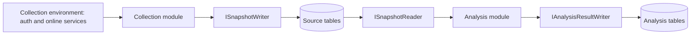

# Collection and analysis foundation (H-F)

H-F provides the shared execution and storage foundation for independently collecting
source evidence and analyzing an explicitly selected snapshot. Existing assessment
modules still use the `legacy` start path. Production registers no fixture module.
ASPX collection, decoding, Handler rules and module report projections are subsequent
C1–C3/A1–A4 work; passing H-F does not accept those business checkpoints or T26.

The planning definition is pinned by SHA-256
`446e75af6788aac73c3cb93d6cc51abec4a600b43bc9efa49a9b8500f43f2bee`.
The implementation starts from upstream main
`cc0788523d84708e5376c6025b0aab3dc759b204`. PR #166 and PR #167 remain separate;
the compatibility SQL fixture records the historical PR #167 DDL without introducing
its active publishing classification logic.

## Shared contracts and composition

Core contains four modules under `Pipeline/`:

| Module | Responsibility |
| --- | --- |
| `Contracts` | Versioned JSON, immutable source records, read/write capabilities and the analysis module interface |
| `Collection` | Collector interface and collection-only configuration/authentication/online environment |
| `Analysis` | Offline TPL Dataflow execution over a selected snapshot and a result writer |
| `Orchestration` | Immutable registrations, rule/input checks, enqueueing, stage transitions and lifecycle |



`ICollectionModule.CollectAsync` yields source facts, original bytes, an opaque
versioned checkpoint and an optional expected record count. The framework commits
each yield before accepting the next checkpoint. The collector can request online
services through `CollectionContext.Environment`; analysis receives no such context.
Future collectors own the collection-specific discovery/retry semantics and credential
bootstrap, and must preserve any discovered membership needed by their checkpoint.

`IAnalysisModule` declares `ModuleKey` and `RuleVersion` and receives one detached
`SourceRecord`, fixed `VersionedJson` parameters and a cancellation token. It returns
an explicit `AnalysisOutcome`, reason and versioned payload. The framework checks that
the returned observation ID matches the input. `SourceArtifact.GetBytes()` returns a
copy. `ISnapshotReader` and `IAnalysisResultWriter` expose neither mutable entities nor
source writes. The analysis executor's signature and IL dependency tests reject PnP,
CSOM, authentication, collection, online and mutable storage dependencies.

`ModuleRegistry` is immutable host composition. Collection registrations name an
input version and factory; analysis registrations name a rule version, supported
input versions and factory. Parameter validators run before enqueueing. Combined
start validates both registrations before creating storage or protecting/restoring
credentials. Current rules are resolved once and persisted; restoring a run requires
the original rule implementation. The test host alone registers `hf-fixture`.

## Native entry points

| CLI | RPC | Behavior |
| --- | --- | --- |
| `collect --module <key> <collection options>` | `Collect` | Creates an assessment and collects/seals its snapshot |
| `analyze --id <assessment> --snapshot-id <snapshot> [--rule-version <version>]` | `Analyze` | Creates a new analysis run using exactly this sealed input |
| `start --module <key> <collection options>` | `StartPipeline` | Collects, seals, then analyzes through the same stage services |
| `start --mode <legacy mode> <legacy options>` | Existing `Start` | Preserves the existing assessment workflow and labels it `legacy` |

Collection reuses existing tenant, scope, authentication, thread and Classic options.
`--parameters` accepts versioned collection JSON. Combined start also accepts
`--analysis-parameters` and `--rule-version`. Analyze accepts versioned `--parameters`
and optional `--threads`, and has no authentication or tenant options. JSON uses
`{"schemaVersion":1,"value":{...}}`.

Phase commands print JSON with `assessmentId`, `snapshotId`, `runId`, the reserved or
created `analysisRunId` and the pinned rule. Enqueueing does not mean a run has finished;
use the common lifecycle commands to inspect it. Source record progress is carried in
new `RecordsCompleted/RecordsTotal` fields, while legacy site counters remain zero for
pipeline runs. List exposes root runs, so repeated analyses remain independently
visible. Child collection/analysis states and their parent IDs are retained in `PhaseRuns`.

`status`, `list`, `pause --id`, `pause --all`, `restart --id`, `stop --id` and engine-wide
`stop` share the existing status enum and cancellation model. `restart --run-id` selects
an older pipeline root explicitly; otherwise it restores the latest root. It preserves
snapshot, rule, parameters, run IDs and committed results. A thread override changes
execution concurrency only. One assessment has one active pipeline root at a time.

Analysis resumes from committed result primary-key membership, rather than trusting
the last completed record as a sequential cursor. Collection restores its own opaque
checkpoint. After a combined run has sealed collection, recovery goes directly to
analysis and needs no collector, credential restoration or online factory. Unsettled
infrastructure failures, cancellation and seal failures never start analysis. Settled
per-record acquisition failures remain explicit source facts and can be analyzed.

Old protobuf field numbers and the old `Start` RPC are preserved. A service that lacks
the new RPC returns an explicit unsupported error; the CLI never falls back to
`Start`. `Ping.SupportsPipeline` protects `stop --id` from older services that would
ignore the new ID field and stop the whole engine. Analyze and phase CLI entry points
skip the online CLI version check. Legacy startup settlement reads local storage
without constructing the PnP/online scan manager.

## Storage and consistency

Each assessment continues using its existing directory and `assessment.db`. Migration
`20261009082224_CollectionAnalysisFoundation` adds only these six tables:

| Table | Owner and invariant |
| --- | --- |
| `SourceSnapshots` | Module/input/scope, fixed membership, manifest, SHA-256 and atomic seal |
| `SourceObservations` | Identity, revision, acquisition status, raw metadata and artifact reference |
| `SourceArtifacts` | Original BLOB, saved length/digest and source ownership |
| `PhaseRuns` | Root/child states, fixed inputs, progress, diagnostics and checkpoint |
| `AnalysisRuns` | Immutable snapshot/manifest digest, rule and analysis parameters |
| `AnalysisResults` | Unique `(analysisRunId, observationId)` results and reasons, with snapshot/source foreign keys |

A missing body is SQL `NULL` with unknown length/digest. An acquired empty body is a
zero-length BLOB with the SHA-256 of empty bytes. Collection facts do not include
Handler projections. Analysis never copies raw BLOBs into its results.

Source, artifact and collector checkpoint/progress commit in one SQLite transaction.
Sealing rereads saved BLOBs, verifies lengths/digests, reciprocal source references,
member identities/revisions, progress and JSON/schema versions, then publishes the
manifest and seal atomically. `Partial`, `Denied`, `NotAttempted` and settled `Failed`
records can belong to a consistent sealed snapshot. A seal describes storage
consistency, not successful acquisition or full source coverage.

Snapshot opening validates the complete manifest and saved evidence. Each analysis
read/result commit checks its pinned member again, and final settlement revalidates the
snapshot. Corruption terminates the run with diagnostics and preserves committed
results; the framework supplies no default successful conclusion. SQLite triggers
prevent modification of sealed source rows, analysis inputs and committed results.
Result and checkpoint/progress writes also share one transaction. Analysis does not
call the legacy `EndScanAsync` that would force failures to `Finished`.

## Compatibility

Historical migrations are unchanged. Upgrading old databases creates empty source
tables and preserves old report rows; raw evidence is never synthesized from them.
Unknown historical migration IDs and extra SQL columns remain present. Current main
has no active `PublishingLayoutRuleVersion` field; compatibility fixtures preserve
that historical column on `Scans` and its migration without using it at runtime.

The historical `TestDelays` table is mapped in both Debug and Release to prevent an
EF migration generated under Release from dropping old data. Existing Classic
discovery, PageType selection, report files, CSV column order and counts are exercised
against before/after exports. Report/PBIT code and assets are unchanged by H-F.

## Reproducible acceptance

Use sibling checkouts `pnpassessment/` and `pnpcore/`; pin PnP Core to release `1.18.0`
at `1f07296b186698c3cc9ca8580f00af36c0f3f4f5`. Place a workflow-specific `global.json`
in their parent directory selecting .NET SDK `8.0.425`; no global tool configuration
is needed. `build/verify-hf.ps1` restricts dependency builds to `net8.0`, resolves
Grpc.Tools from the actual package assets and installs EF `8.0.3` under the output
directory. It writes TRX, binary/schema/input/result identities, a SQLite backup and
scenario-level receipts. It restores temporary process environment settings on exit.

```powershell
./build/verify-hf.ps1 -Suite Foundation -OutputDirectory ../acceptance-foundation
./build/verify-hf.ps1 -Suite Release -OutputDirectory ../acceptance-release
```

Both default to committed source; `-AllowDirty` is for development diagnostics.
The final Release receipt must have clean source and a concrete commit. H-F test
methods are labelled `T28_`–`T33_` and tagged `Category=HFFoundation`:

| Scenario | Evidence |
| --- | --- |
| T28 | Signature/IL dependencies, capability boundaries, byte-copy isolation and analysis with auth/PnP/online factories forbidden |
| T29 | Transaction interruption, absent/wrong artifacts, length/hash/schema faults, empty/NULL, immutable seals and corruption during analysis |
| T30 | Real CLI binding plus loopback gRPC, preflight, separate/combined runs, collection/analysis pause and recovery, concurrent checkpoints, stop and old service rejection |
| T31 | Independent same/new rule runs over S1 after later S2/current configuration, with unchanged original bytes/revisions/digests |
| T32 | Main/historical old database upgrades and reopen, inert extra fields/history, unchanged exports/counts and local legacy startup settlement |
| T33 | Fixed mixed-outcome fixture through native combined start, close/reopen, offline reanalysis and a persisted acceptance receipt |

The source fixture digest is
`4d72c87d3e36b2a682b464af9ac26106dfdb0f0468bde94e6e93468f1781b7a5`.
Its six records cover content, empty content, partial content, denied, not attempted
and settled acquisition failure. These prove foundation behavior and deliberately
carry no ASPX Handler oracle.

The existing [main CI run](https://github.com/pnp/pnpassessment/actions/runs/37737734710)
passed 208 tests; [PR #166 CI](https://github.com/pnp/pnpassessment/actions/runs/37799416857)
passed 253. Both logs identify PnP Core `1.18.0` at the commit above and installation
of SDK `8.0.425`, with `net8.0` test output. They do not print the effective selected
SDK and should not be treated as new H-F acceptance. Local receipts record the
actual selected SDK and complete resolved dependency list.
