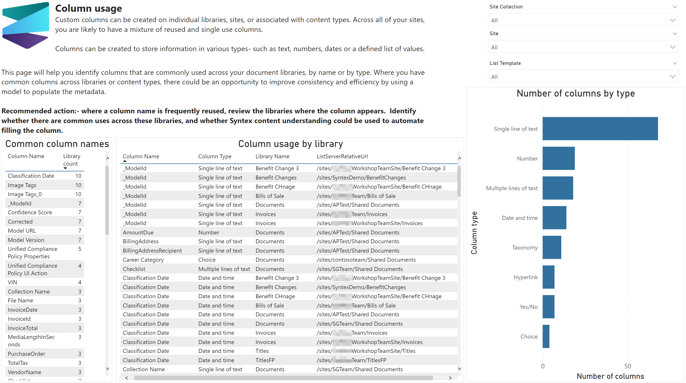

# Column usage

Custom columns can be created on individual libraries, sites, or associated with content types. Across all of your sites, you are likely to have a mixture of reused and single use columns.

Columns can be created to store information in various types- such as text, numbers, dates or a defined list of values.

This page will help you identify columns that are commonly used across your document libraries, by name or by type. Where you have common columns across libraries or content types, there could be an opportunity to improve consistency and efficiency by using a model to populate the metadata.

## Sample page

