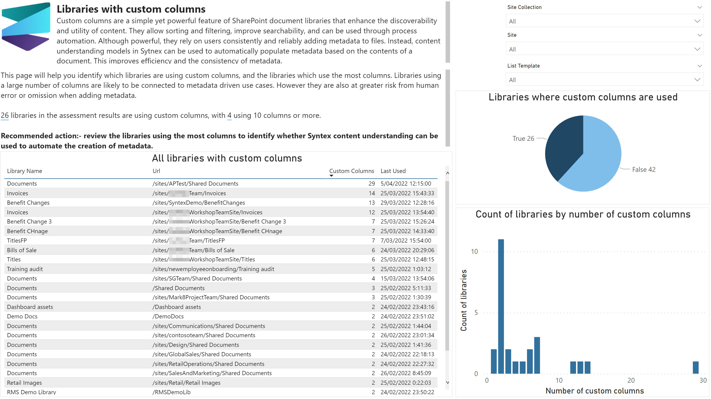

# Libraries with custom columns

Custom columns are a simple yet powerful feature of SharePoint document libraries that enhance the discoverability and utility of content. They allow sorting and filtering, improve searchability, and can be used through process automation. Although powerful, they rely on users consistently and reliably adding metadata to files. Instead, content understanding models in Syntex can be used to automatically populate metadata based on the contents of a document. This improves efficiency and the consistency of metadata.

This page will help you identify which libraries are using custom columns, and the libraries which use the most columns. Libraries using a large number of columns are likely to be connected to metadata driven use cases. However they are also at greater risk from human error or omission when adding metadata.

## Sample page

