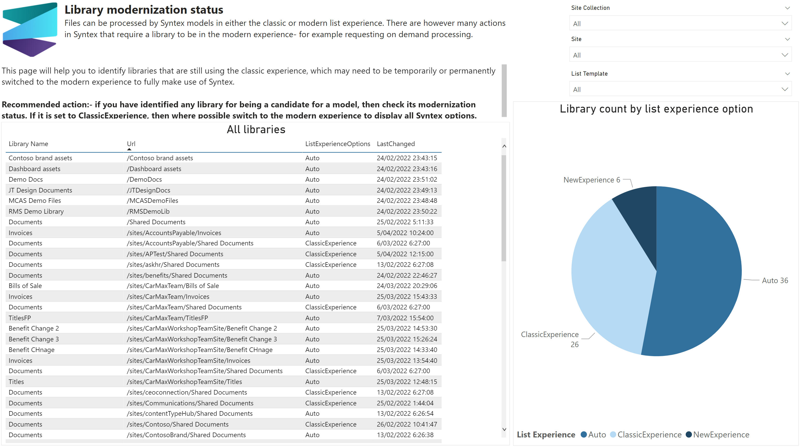

# Library modernization status

Files can be processed by Syntex models in either the classic or modern list experience. There are however many actions in Syntex that require a library to be in the modern experience- for example requesting on demand processing.

This page will help you to identify libraries that are still using the classic experience, which may need to be temporarily or permanently switched to the modern experience to fully make use of Syntex.

## Sample page

