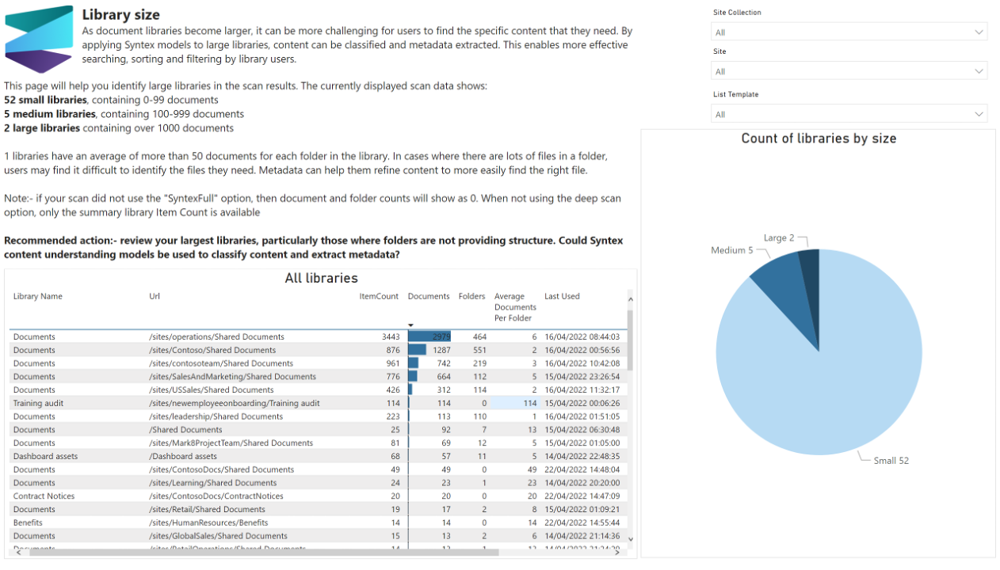

# Library size

As document libraries become larger, it can be more challenging for users to find the specific content that they need. By applying Syntex models to large libraries, content can be classified and metadata extracted. This enables more effective searching, sorting and filtering by library users.

This page will help you identify large libraries in the scan results.

## Sample page

