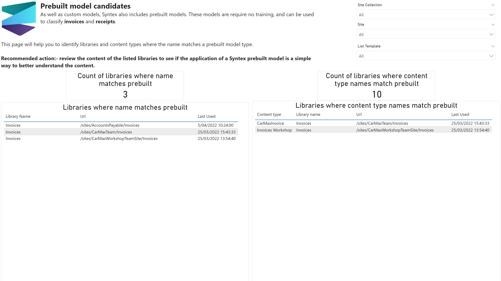

# Prebuilt model candidates

As well as custom models, Syntex also includes prebuilt models. These models are require no training, and can be used to classify invoices and receipts.

This page will help you to identify libraries and content types where the name matches a prebuilt model type.

## Sample page

