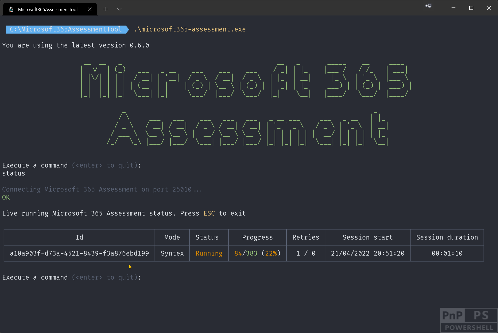
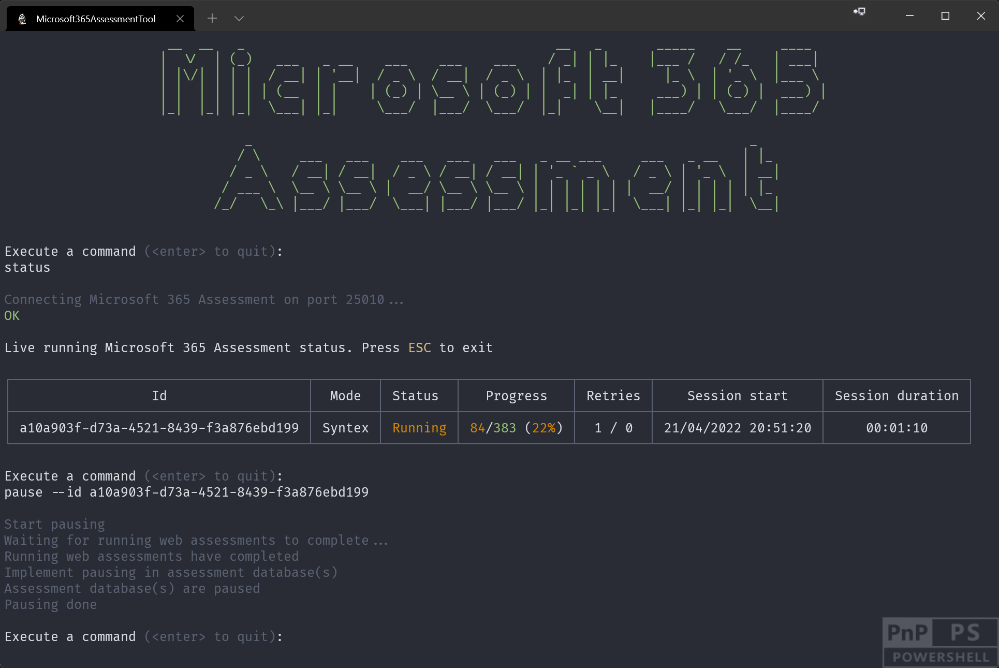

# Assessment operational tasks

So you've kicked off an assessment and want to followup on the assessment progress or you want to pause a running assessment because you need to shut down the computer running the assessment. All of these tasks, and more, are possible using the operational actions supported by the Microsoft 365 Assessment tool.

## Listing the available assessments

 Assessment data is gathered inside folders underneath the folder hosting the Microsoft 365 Assessment tool and you can enumerate the done, running, paused and terminated assessments via the `list` action.

### Sample list commands

Before diving into all the possible command line arguments let's first show some typical use cases:

Task | CLI
-----|------
List all the assessments | microsoft365-assessment.exe list
List the paused assessments | microsoft365-assessment.exe list --paused

### Command line arguments

The easiest way to see all possible command line arguments for a command (e.g. for `list`) is using the `--help` parameter.

### Listing specific assessments

By default all assessments will be returned ordered by assessment status, followed by a order on assessment age. This means that most recent assessments will be at the bottom of the list. You can however only list assessments in a given status by using either the `--running`, `--paused`, `--finished` or `--terminated` arguments. These argument can be combined to for example list all paused and terminated assessments.

### List output

When using the `list` action a table is generated listing all the assessment that match the criteria. Following columns are listed in the table:

Column | Description
-------|------------
Id | The assessment id
Mode | The assessment mode (e.g. Syntex) defines the adoption or deprecation scenario the assessment is targeting
Status | The assessment status: `finished` is a successfully ended assessment, `paused` is a paused assessment, `running` is an assessment that still is in progress and `terminated` means that the assessment was interrupted (e.g. when the computer running the assessment was shut down)
Progress | Shows how many site collections of the total in scope site collections are assessed
Started at | When was this assessment for the first time started
Ended at | When was this assessment finished

## Getting a live status overview of a running assessment

Once an assessment is started you often want to see it's progress. For that you can use the above described `list` action, but more convenient for this purpose is the `status` action as it does a continuos refresh, hence providing a live status overview.

### Sample status command

Task | CLI
-----|------
Realtime status update of the running assessments | microsoft365-assessment.exe status

### Status output

When using the `status` action a table is generated listing all the running assessments. Following columns are listed in the table:

Column | Description
-------|------------
Id | The assessment id
Mode | The assessment mode (e.g. Syntex) defines the adoption or deprecation scenario the assessment is targeting
Status | The assessment status: `finished` is a successfully ended assessment, `paused` is a paused assessment, `running` is an assessment that still is in progress and `terminated` means that the assessment was interrupted (e.g. when the computer running the assessment was shut down)
Progress | Shows how many site collections of the total in scope site collections are assessed
Retries | Whenever a request is queued for retry a counter will increased. Throttled requests are counted in the first section (1 in the screenshot), requests failed due to network issues are listed in the second section (0 in the screenshot)
Session start | When was this assessment run started. If you've restarted an assessment the restart time is shown here
Session duration | How long has the current assessment session been running

### I'm scanning a huge number of site collections and the assessment seems to be stuck, what should I do?

When the assessment runs it will use 2 parallel operations per site collection for processing the sites and sub sites combined with multiple parallel operations processing site collections. This means that when the assessment is processing site collections with a large amount of sub sites this can take a while. The easiest approach to understand if an assessment is still progressing in checking the status output (Progress column), but if that's not changing anymore taking a peek at the last log entries will provide clarity:

- Go the folder hosting the Microsoft 365 Assessment tool
- Open the sub folder for your assessment (assessment id = sub folder name)
- On Windows use `Get-Content .\log_a9dc3fda-e14b-421e-8a85-cbb9b1c4ebfa.txt -Tail 20 -Wait` to keep showing the last 20 lines of your log file, on macOS and Linux use `tail log_e1396c6c-5ff0-4b4f-af00-a7c596ea82f0.txt -n 20 -f`

If the log file is not showing any meaningful updates for a long time then the assessment might be stuck. If that's the case then: 

- Continue with pausing the assessment via `microsoft365-assessment.exe pause --id <assessment id>`. See next chapters for details
- Stop all assessment processes `microsoft365-assessment.exe stop`. See [here](assess-stop.md) for details
- Restart the assessment via `microsoft365-assessment.exe restart --id <assessment id>`. See next chapters for details

## Pausing a running assessment

Sometimes you need to pause a running assessment because you need to shutdown the computer running the assessment or the assessment is very heavily throttled. This is possible using the `pause` action.

### Sample pause command

Task | CLI
-----|------
Pause a running assessment | microsoft365-assessment.exe pause --id 22989c75-f08f-4af9-8857-6f19e333d6d3

### Command line arguments

The easiest way to see all possible command line arguments for a command (e.g. for `pause`) is using the `--help` parameter.

By default you pause one assessment by specifying the assessment to pause using the `--id` argument, but you can also opt to pause all running assessments using the `-all:$true` argument.

## Restarting a paused or terminated assessment

### Sample restart command

Task | CLI
-----|------
Restart a paused or terminated assessment | microsoft365-assessment.exe restart --id 22989c75-f08f-4af9-8857-6f19e333d6d3

### Command line arguments

The easiest way to see all possible command line arguments for a command (e.g. for `restart`) is using the `--help` parameter.

Restarting happens per assessment and you specify the assessment to restart via the `--id` argument. When restarting an assessment you do have the option to change the number of parallel operations via the `--threads` argument. If you omit this argument the assessment will restart using the number of parallel operations set at assessment start.

## Clearing authentication caches

When using delegated permissions in combination with either `--authmode` equal to `Interactive` or `Device` then you're seeing a one time prompt for credentials when you use this option for the first time. As part of this operation the authentication library (MSAL) state is cached on disk using machine/user specific encryption. With this cache the Microsoft 365 Assessment tool can automatically request new access tokens whenever that's needed. If you're however switching between tenants or you want to remove this stored cache you can do so via the `cache` action.

### Sample pause command

Task | CLI
-----|------
Clear authentication cache | microsoft365-assessment.exe cache --clearauthentication

> [!Note]
> An alternative way of clearing this cache is by deleting the `msalcache.bin` file inside the folder hosting `microsoft365-assessment.exe`.
