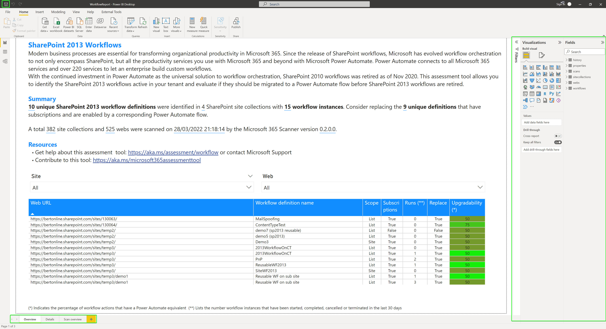

# The Power BI report

The generated report is a Power BI report and can be opened in Power BI Desktop (see https://aka.ms/pbidesktopstore to install Power BI Desktop).

When using the report from Power BI Desktop there are some things to understand:

- The report is built using multiple pages, use the bottom tabs to switch to different report pages. The Overview page will give you a quick overview while the Details page allows you to further drill in
- When the report is opened from the generated Power BI pbit file it's not saved, meaning if you close Power BI Desktop it will ask you to save the file. You can also save the opened report yourselves using the **save** icon top left, when saving as a Power BI pbix file the data and report are combined into a single file, making it easier for your to move around and share the report
- If you want to update the visalizations used you can use the toolbar and visualizations and fields sections at the right

You can use the left navigation to learn more about each report page.
